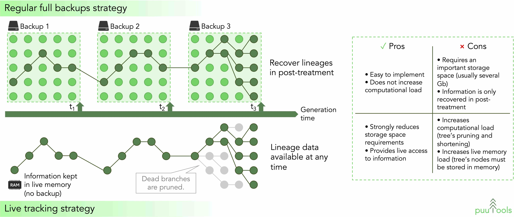

<!--<h1 align="center">puuTools</h1>-->

<em>Live tracking of lineage/phylogenetic trees and evolutionary events in individual-based forward-in-time simulations of evolution.</em>
 
<em>(Puu is the Finnish word for tree)</em>
  
&nbsp;&nbsp;

## Content

- [Aim](#aim)
- [What is puuTools](#puutools)
- [Installation instructions](#installation)
- [First usage with examples](#first_usage)
  - [Wright-Fisher population](#wright_fisher)
  - [Allopatric speciation](#allopatric_speciation)
  - [A complex scenario where puuTools can be useful](#complex_scenario)
- [Copyright](#copyright)
- [License](#license)

## Aim

<kbd>

</kbd>
 
Helmi Biese - View from Pyynikki Ridge, 1900.

Individual-based forward-in-time evolutionary simulations are more and more common, and have been proven useful in many fields (ecology and evolution, conservation biology, systems biology, etc).

As models' complexity tends to increase, it becomes crucial to develop tools which efficiently track the lineages of <em>in silico</em> populations and provide exhaustive access to all evolutionary events during a simulation.

When dealing with complex evolutionary simulations, one solution consists in producing full simulation backups at regular intervals during a simulation, in order to recover lineage information in post-processing. However, such an approach usually requires gigabytes of storage, as it saves more information than strictly necessary to recover lineages, limiting the opportunities to produce light and portable simulation software (Fig. 1).

Because precisely recovering the evolutionary events that led to the final state of a population is one major interest of evolutionary simulations, keeping trace of the lineages that did not went extinct is relevant. Thus, another solution consists in dynamically tracking the lineage trees during a simulation, in order to only keep the pertinent information in memory. Moreover, such an approach provides live access to the lineage and phylogenetic relationships, including tracing back evolutionary events, at any time during a simulation.
While this approach comes at slightly higher computational and live memory cost (it is necessary to maintain in memory and regularly update the structure of the tree), it is much lighter and efficient than backing up everything and running post-treatments.

This functionality is usually re-implemented from scratch in different simulation software, at the cost of re-investing time to optimize the algorithms. The aim of <strong>puuTools</strong> is to help developers by offering an easy-to-use and light framework to manage lineage and phylogenetic information on the fly during an evolutionary simulation.

## What is puuTools 

<strong>puutools</strong> allows to dynamically create, track and manage lineage and/or phylogenic trees during individual-based forward-in-time simulations of evolution.

With <strong>puutools</strong>, it is possible to update the lineage and/or the phylogenic tree of a population at each generation during a simulation, and to track and recover any evolutionary events. <strong>puutools</strong> is easy to deploy and versatile.

<strong>puutools</strong> is an all-in-one library. It does not depend on third-party packages, and its code is kept simple and light. <!--Learn more about what is under the hood [here](#behind_the_scene).-->

The code of <strong>puutools</strong> has primarily been implemented and optimized during the European project <a href="http://www.evoevo.eu/">EvoEvo</a> (FP7-ICT-610427), as patt of the <a href="https://github.com/charlesrocabert/Evo2Sim">Evo2Sim</a> software (see https://doi.org/10.1371/journal.pcbi.1005459). The code has also been used in <a href="https://github.com/charlesrocabert/SigmaFGM">&sigma;FGM</a> framework (see https://doi.org/10.1111/evo.14083).
To date, <strong>puutools</strong> is distributed as a static library for C++ developers. We plan to provide a Python-binding in a future version.

## Installation instructions 

### Supported platforms

<strong>puutools</strong> library has been successfully tested on Ubuntu and MacOS.

### Required dependencies

- A C++11 compiler (GCC, LLVM, ...);
- zlib;

## First usage with examples 

### Wright-Fisher population 

### Allopatric speciation 

### A complex scenario where puutools has been useful 

## Behind the scene

Algorithms used

## Copyright 
Copyright &copy; 2022 Charles Rocabert.
All rights reserved.

## License 

This program is free software: you can redistribute it and/or modify it under the terms of the GNU General Public License as published by the Free Software Foundation, either version 3 of the License, or (at your option) any later version.

This program is distributed in the hope that it will be useful, but WITHOUT ANY WARRANTY; without even the implied warranty of MERCHANTABILITY or FITNESS FOR A PARTICULAR PURPOSE. See the GNU General Public License for more details.

You should have received a copy of the GNU General Public License along with this program. If not, see http://www.gnu.org/licenses/.

