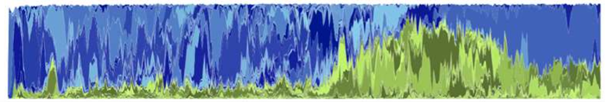

<p align="center">

</p>

<p align="center">
<em>Easy-to-use C++ library for the live tracking of lineage and coalescence trees in individual-based forward-in-time simulations.</em>
<br/><br/>
<a href="https://github.com/charlesrocabert/puutools/releases/latest"></a>&nbsp;
<a href="https://github.com/charlesrocabert/puutools/actions"></a>&nbsp;
<a href="https://github.com/charlesrocabert/puutools/LICENSE.html"></a>
</p>

## Content

- [Aim](#aim)
- [What is puutools](#puutools)
- [Contributing](#contributing)
- [Installation instructions](#installation)
- [CMake find module](#findmodule)
- [Copyright](#copyright)
- [License](#license)
- [First usage with a walk-through example](#first_usage)
- [A complex scenario where puutools can be useful](#complex_scenario)

## Aim

<p align="center">
<kbd>

</kbd>
<br/>
<sup>Helmi Biese - View from Pyynikki Ridge, 1900.</sup>
</p>

<p align="justify">
Individual-based forward-in-time evolutionary simulations are more and more common, and have proven useful in many fields (ecology and evolution, conservation biology, systems and computational cell biology, etc).

Recovering the evolutionary and mutational events is one major interest of evolutionary simulations. It requires tools which efficiently track the lineages of <em>in silico</em> populations, providing exhaustive access to the simulation events that led to the final state of a population.
</p>

<p align="justify">
One solution consists in producing full backups at regular intervals during a simulation, in order to recover lineage information in post-processing. However, this approach usually requires gigabytes of storage, as it saves more information than strictly necessary, and then limits the opportunities to produce light and portable simulation software.
</p>

<p align="justify">
Another solution consists in dynamically tracking the lineage and/or coalescence trees during a simulation, in order to only keep the pertinent information in live memory. Such an approach provides live access to ancestor relationships (including tracing back evolutionary events) at any time during a simulation.
While this approach comes at slightly higher computational and live memory costs (it is necessary to maintain in memory and regularly update the structure of the trees), it is much lighter and efficient than backing up everything and running post-treatments.
</p>

<p align="justify">
This functionality is usually re-implemented from scratch in different simulation software, at the cost of re-investing time to optimize the algorithms. The aim of <strong>puutools</strong> is to help developers by offering an <strong>easy-to-use</strong> and <strong>light</strong> framework to manage lineage and coalescence information on the fly during an evolutionary simulation.
</p>

<p align="center">

</p>

## What is puutools <a name="puutools"></a>

<p align="justify">
<strong>puutools</strong> is a C++ library which allows to dynamically create, track and manage lineage and/or coalescence trees during individual-based forward-in-time simulations of evolution.
</p>

<p align="justify">
With <strong>puutools</strong>, it is possible to update the lineage and/or the coalescence tree of a population at each generation during a simulation, and to track and recover evolutionary events at any time. <strong>puutools</strong> is easy to deploy and versatile, providing the user with a small set of integrated functions.
</p>

<p align="justify">
<strong>puutools</strong> is an all-in-one library. It does not depend on third-party packages, and its code is kept simple and light. By the way, <strong>puutools</strong> comes as and header-only library, so specific compilation is not needed.
</p>

<p align="justify">
The code of <strong>puutools</strong> has primarily been implemented and optimized during the European project <a href="http://www.evoevo.eu/">EvoEvo</a> (FP7-ICT-610427), as part of the <a href="https://github.com/charlesrocabert/Evo2Sim">Evo<sup>2</sup>Sim</a> software (see <a href="https://doi.org/10.1371/journal.pcbi.1005459">Rocabert et al. 2017</a>). The code has also been used in <a href="https://github.com/charlesrocabert/SigmaFGM">&sigma;FGM</a> framework (see <a href="https://doi.org/10.1111/evo.14083">Rocabert et al. 2020</a>).
To date, <strong>puutools</strong> is distributed as a static library for C++ developers. We plan to provide a Python-binding in a future version.
</p>

## Contributing <a name="contributing"></a>

If you want to contribute, do not hesitate to reach <a href="mailto:charles DOT rocabert AT helsinki DOT fi">the main author</href>.

## Installation instructions <a name="installation"></a>

### Supported platforms

<p align="justify">
<strong>puutools</strong> library has been primarily developed for Unix/Linux and macOS systems.
</p>

### Required dependencies

- A C++11 compiler (GCC, LLVM, ...);
- CMake >= 3.19 (command line version);

**Additional dependencies for the example code:**

- Gnu Scientific Library (GSL);
- CBLAS;
- R >= 4.0.0;
- Rpackage ape;

### Installation

<p align="justify">
Download the <a href="https://github.com/charlesrocabert/puutools/releases/latest">latest release</a> of <strong>puutools</strong>, and save it to a directory of your choice. Open a terminal and use the <code>cd</code> command to navigate to this directory. To install <strong>puutools</strong>, simply call <code>install.sh</code> on the command line:
</p>

```
sh install.sh
```

<p align="justify">
The script requires sudo access to install the library in the appropriate folder. <strong>puutools</strong> comes as a single C++ header file, and will be usually installed in an <code>include</code> directory (usually <code>/usr/local/include</code>).

:warning: If you cannot or do not want to use a sudo access, simply <a href="https://github.com/charlesrocabert/puutools/raw/main/puutools/puutools.h">download the source code file <code>puutools.h</code></a> and include it directly to your project.
</p>

## CMake find module <a name="findmodule"></a>

<p align="justify">
This CMake module is useful to determine whether <strong>puutools</strong> package is available during the compilation of your project.
It has also the advantage to determine the paths with no need to provide them explicitly in the <code>CMakeLists.txt</code> file.
</p>

<p align="justify">
You can download here the module: <a href="https://github.com/charlesrocabert/puutools/raw/main/cmake_find_module/FindPuuTools.cmake" target="_blank">CMake Find Module</a>
</p>

<p align="justify">
Then add the piece of code below in your <code>CMakeLists.txt</code> file:
</p>

```
find_package(PUUTOOLS REQUIRED)
if(PUUTOOLS_FOUND)
  include_directories(${PUUTOOLS_INCLUDE_DIR})
endif(PUUTOOLS_FOUND)
```

## Copyright <a name="copyright"></a>
Copyright &copy; 2022-2023 Charles Rocabert.
All rights reserved.

## License <a name="license"></a>
<p align="justify">
This program is free software: you can redistribute it and/or modify it under the terms of the GNU General Public License as published by the Free Software Foundation, either version 3 of the License, or (at your option) any later version.
</p>

<p align="justify">
This program is distributed in the hope that it will be useful, but WITHOUT ANY WARRANTY; without even the implied warranty of MERCHANTABILITY or FITNESS FOR A PARTICULAR PURPOSE. See the GNU General Public License for more details.
</p>

<p align="justify">
You should have received a copy of the GNU General Public License along with this program. If not, see http://www.gnu.org/licenses/.
</p>

## First usage with a walk-through example <a name="first_usage"></a>

<p align="justify">
You will find a <a href="https://github.com/charlesrocabert/puutools/tree/main/example" target="_blank">complete walk-through example</a> to get used to the main functionalities of <strong>puutools</strong>.
</p>

## A complex scenario where puutools has been useful <a name="complex_scenario"></a>

<p align="center">
    
</p>

<p align="justify">
The original code of <strong>puutools</strong> has been used for research purpose as part of the bacterial evolution simulator <a href="https://github.com/charlesrocabert/Evo2Sim">Evo<sup>2</sup>Sim</a>. The software has for example been used to study bacterial diversification events in batch culture setups, due to stable cross-feeding (see <a href="https://doi.org/10.1371/journal.pcbi.1005459">Rocabert et al. 2017</a>). Tracking lineages and coalescence trees was an essential step in this scientific work. An example of simulation output is available here: https://charlesrocabert.github.io/doc/evo2sim_simulation_example/viewer/viewer.html.
</p>

