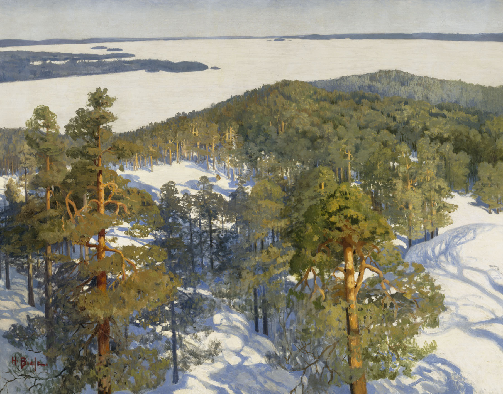

<h1 align="center">puuTools</h1>

    <kbd>
    
    </kbd>
     
    <a href="https://www.kansallisgalleria.fi/en/object/614144" target="_blank">(Helmi Biese) - View from Pyynikki Ridge, 1900.</a>
     
    <em>Live-management toolbox for lineage and phylogenetic trees in individual-based simulations</em>
      
    &nbsp;&nbsp;&nbsp;

