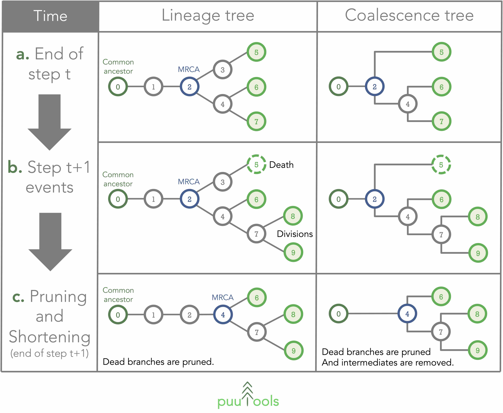
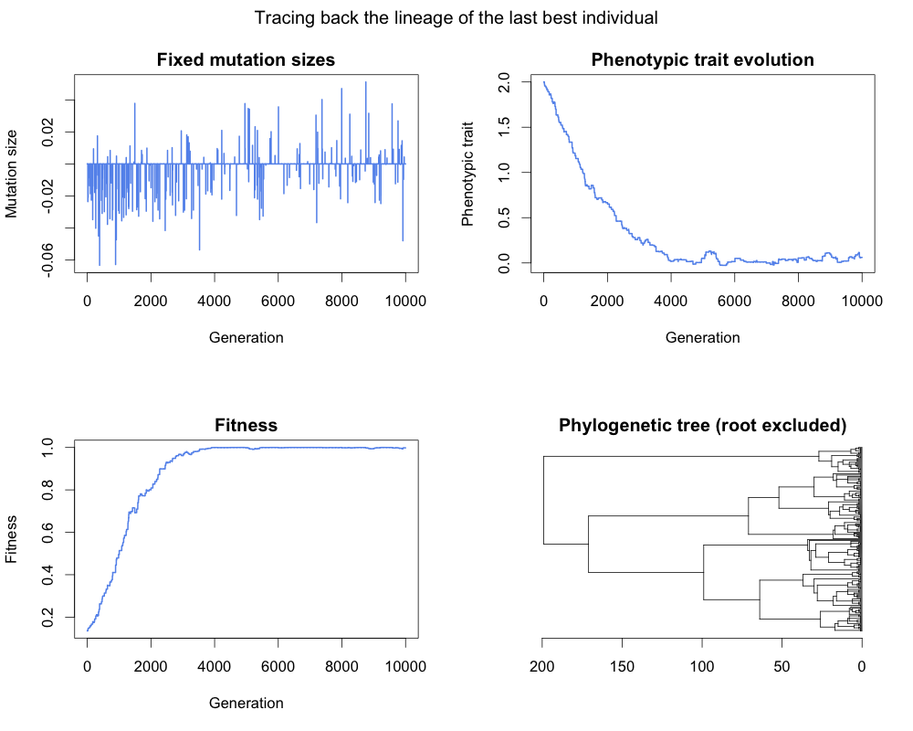

<p align="center">

</p>

<p align="center"><strong>Walk-through example</strong></p>

## Content

- [1) Introduction](#introduction)
- [2) Pre-processor include directives](#include)
- [3) Read command line parameters](#parameters)
- [4) Instanciate the pseudo-random numbers generator (PRNG)](#prng)
- [5) Initialize the population](#initialize)
- [6) Create a lineage and a coalescence tree, and add the roots](#roots)
- [7) Run the evolutionary algorithm](#run)
- [8) Final step: extracting information from the trees](#final_step)
- [9) Results](#results)

## 1) Introduction <a name="introduction"></a>

The main idea behind <strong>puutools</strong> is to dynamically update trees structure on the fly during a simulation, in order to minimize the amount of data in live memory. The performance of <strong>puutools</strong> algorithms have been heavily optimized.

<p align="center">

</p>

<p align="justify">
If you haven't done it already, please read the <a href="https://github.com/charlesrocabert/puutools/blob/main/README.md" target="_blank">main documentation</a> to install <strong>puutools</strong> on your device.
</p>

<p align="justify">
<strong>puutools</strong> is distributed as an external static library. Once installed, the header must be included with the standard <code>#include</code> directive:
</p>

```c++
#include <puutools.h>
```

<p align="justify">
The main object is the class <code>puu_tree<selection_unit></code> which instanciates a dynamical representation of a lineage or coalescence tree. <code>puu_tree<selection_unit></code> is a template class: <code>selection_unit</code> can be any class of your own, with the only constraint that the <strong>copy constructor must be fully implemented</strong>.
</p>

<p align="justify">
In this example, we will implement a basic algorithm to simulate the evolution of a population of constant size $N$. Individuals are asexual and generations are non-overlapping. Each individual owns a phenotypic trait $x \in \mathbb{R}$ which mutates with a probability $m$ (per individual per generation) and a size $s$, such that the mutated trait $x' = x + \epsilon,\ \epsilon \sim \mathcal{N}(0, s)$. Individual's fitness is calculated with the well-known Gaussian fitness function $w = e^{-\frac{x^2}{2}}$. The number of descendants at each generation is fitness proportionate, meaning that it is drawn in a multinomial distribution.
</p>

<p align="justify">
We will implement five command line arguments as simulation parameters:

- The initial trait value $x_0$;
- The simulation time $T$ (in generations);
- The population size $N$;
- The mutation rate $m$;
- The mutation size $s$;
</p>

<p align="justify">
We will now walk through <strong>puutools</strong> step by step.
</p>

## 2) Pre-processor include directives <a name="include"></a>

<p align="justify">
We first include the necessary standard library (<code>std</code>) utilitaries and the <strong>puutools</strong> library:
</p>

```c++
#include <iostream>
#include <vector>
#include <tuple>
#include <assert.h>
#include <puutools.h>
```

<p align="justify">
We then include three classes that have been pre-implemented on purpose for this tutorial (see the <code>example</code> folder of this repository):
</p>

```c++
#include "Prng.h"
#include "Individual.h"
#include "Simulation.h"
```

<p align="justify">
The <code>Prng</code> class contains several random functions based on the <a href="https://www.gnu.org/software/gsl/" target="_blank">GNU Scientific Library</a>. The class <code>Individual</code> contains the basic structure of an individual (one phenotypic trait and one fitness value, plus a few methods); this class will be provided to <strong>puutools</strong> to instanciate trees. The class <code>Simulation</code> contains all the code to run a proper evolutionary simulation.
</p>

## 3) Read command line parameters <a name="parameters"></a>

<p align="justify">
Let's implement a basic piece of code to read our parameters from the command line:
</p>

```c++
int main( int argc, char const** argv )
{
  /*~~~~~~~~~~~~~~~~~~~~~~~~~~~~~~~~~~~~~~~*/
  /* 1) Read simulation parameters         */
  /*~~~~~~~~~~~~~~~~~~~~~~~~~~~~~~~~~~~~~~~*/

  assert(argc==6);
  (void)argc;
  double  initial_trait_value = atof(argv[1]);
  int     simulation_time     = atoi(argv[2]);
  int     population_size     = atoi(argv[3]);
  double  mutation_rate       = atof(argv[4]);
  double  mutation_size       = atof(argv[5]);
  std::cout << "> Running a simulation with the following parameters:" << std::endl;
  std::cout << "  • Initial trait value: " << initial_trait_value << std::endl;
  std::cout << "  • Simulation time    : " << simulation_time << std::endl;
  std::cout << "  • Population size    : " << population_size << std::endl;
  std::cout << "  • Mutation rate      : " << mutation_rate << std::endl;
  std::cout << "  • Mutation size      : " << mutation_size << std::endl;
```

## 4) Instanciate the pseudo-random numbers generator (PRNG) <a name="prng"></a>

<p align="justify">
We also instanciate a PRNG object:
</p>

```c++
  /*~~~~~~~~~~~~~~~~~~~~~~~~~~~~~~~~~~~~~~~*/
  /* 2) Create the prng                    */
  /*~~~~~~~~~~~~~~~~~~~~~~~~~~~~~~~~~~~~~~~*/

  Prng prng(time(0));
```

## 5) Initialize the population <a name="initialize"></a>

<p align="justify">
This step is used to create the simulation and initialize the population:
</p>

```c++
  /*~~~~~~~~~~~~~~~~~~~~~~~~~~~~~~~~~~~~~~~*/
  /* 3) Create the simulation              */
  /*~~~~~~~~~~~~~~~~~~~~~~~~~~~~~~~~~~~~~~~*/

  Simulation simulation(&prng, initial_trait_value, population_size, mutation_rate, mutation_size);
  simulation.initialize_population();
```

## 6) Create a lineage and a coalescence tree, and add the roots <a name="roots"></a>

<p align="justify">
We will create two trees:

- A lineage tree, which will contain parent-children relationships at every generations,
- A coalescence tree, which will only contain common ancestors.
</p>

```c++
  /*~~~~~~~~~~~~~~~~~~~~~~~~~~~~~~~~~~~~~~~*/
  /* 4) Create trees and add roots         */
  /*~~~~~~~~~~~~~~~~~~~~~~~~~~~~~~~~~~~~~~~*/

  puu_tree<Individual> lineage_tree;
  puu_tree<Individual> coalescence_tree;

  for (int i = 0; i < population_size; i++)
  {
    lineage_tree.add_root(simulation.get_individual(i));
    coalescence_tree.add_root(simulation.get_individual(i));
  }
```

<p align="justify">
We first instanciate two trees with the class <code>Individual</code>. It is <strong>not mandatory</strong> to name your individual class "Individual". You can use any class name.
</p>

<p align="justify">
We then add a <strong>root</strong> in the trees for each of the $N$ individuals at generation zero, with the function <code>add_root(*individual)</code>. <strong>It is essential to root a tree at the beginning of a simulation</strong>.
</p>

## 7) Run the evolutionary algorithm <a name="run"></a>

<p align="justify">
This is the core of our "simple" example. Tasks have been written as separate pieces of code for clarity, however it is possible to optimize the code by merging several loops together.
At each generation:

1) The next generation of individuals is created;
2) All reproduction events are added to the trees;
3) The previous generation is "inactivated" in the trees;
4) The population is updated with next generation's individuals;
5) Trees structures are updated;
</p>

```c++
  /*~~~~~~~~~~~~~~~~~~~~~~~~~~~~~~~~~~~~~~~*/
  /* 5) Evolve the population              */
  /*~~~~~~~~~~~~~~~~~~~~~~~~~~~~~~~~~~~~~~~*/

  for (int generation = 1; generation <= simulation_time; generation++)
  {
    if (generation%1000==0)
    {
      std::cout << ">> Generation " << generation << "\n";
    }

    /* STEP 1 : Create the next generation
       ------------------------------------ */
    simulation.create_next_generation();

    /* STEP 2 : Add reproduction events
       --------------------------------- */
    Individual* parent;
    Individual* descendant;
    std::tie(parent, descendant) = simulation.get_first_parent_descendant_pair();
    while (parent != NULL)
    {
      lineage_tree.add_reproduction_event(parent, descendant, (double)generation);
      coalescence_tree.add_reproduction_event(parent, descendant, (double)generation);
      std::tie(parent, descendant) = simulation.get_next_parent_descendant_pair();
    }

    /* STEP 3 : Inactivate parents
       ---------------------------- */
    for (int i = 0; i < population_size; i++)
    {
      lineage_tree.inactivate(simulation.get_individual(i), true);
      coalescence_tree.inactivate(simulation.get_individual(i), false);
    }

    /* STEP 4 : Replace the current population with the new one
       --------------------------------------------------------- */
    simulation.update_population();

    /* STEP 5: Update the lineage and coalescence trees
       ------------------------------------------------- */
    lineage_tree.update_as_lineage_tree();
    coalescence_tree.update_as_coalescence_tree();
  }
```

<p align="justify">
At <strong>STEP 2</strong>, we register in the trees every reproduction events to add the new node relationships.
This is done with the method <code>add_reproduction_event(*parent, *child, time)</code>.
</p>

<p align="justify">
At <strong>STEP 3</strong>, we must tell to our trees that individuals from the previous generation are now dead, with the method <code>inactivate(*individual, copy)</code>. The parameter <code>copy</code> is a boolean (<code>true/false</code>). If true, the tree will keep a copy of the individual, to save it independently from your population algorithm (this is why it is mandatory to implement a copy constructor with <strong>puutools</strong>). Remember that calling the method <code>inactivate(*individual, copy)</code> depends on your algorithm. Indeed, it can happen that both the parent and its children remain alive at the next generation (<em>e.g.</em> for a bacterial population). However <strong>using this function is mandatory</strong>, as tree's structure manipulations can only be done with dead individuals.
</p>

<p align="justify">
Note that at <strong>STEP 3</strong>, we copy the dead individuals in the lineage tree, but not in the coalescence tree. Indeed, we will recover later the evolution of the phenotypic trait and the fitness from the lineage tree, while we will only extract the structure of the coalescence tree.
</p>

<p align="justify">
<strong>:bulb: TIP:</strong> It is not mandatory to call the <strong>STEP 5</strong> at each generation. Simply remember that if the trees are updated more often, this will increase the computational load. If the trees are updated less often, this will increase the memory load (trees grow at each generation before being pruned and shortened). The user must decide on the period of trees' updates depending on the performance of its own code.
</p>

<p align="justify">
<strong>:bulb: TIP:</strong> The size of a coalescence tree is approximately constant over time (2n-1 nodes), while a lineage tree will grow slowly. Depending on the complexity of your simulation, in can be useful to create a secondary class saving important information from your individuals (<em>e.g.</em> phenotypic trait values, mutational events, etc) and provide it to the trees instead of your main individual class.
</p>

## 8) Final step: extracting information from the trees <a name="final_step"></a>

<p align="justify">
Now that the simulation reached an end, we will extract some information from the trees.
We call a last time update functions to ensure a good final structure:
</p>

```c++
  /*~~~~~~~~~~~~~~~~~~~~~~~~~~~~~~~~~~~~~~~*/
  /* 6) Save lineage and coalescence data  */
  /*~~~~~~~~~~~~~~~~~~~~~~~~~~~~~~~~~~~~~~~*/

  lineage_tree.update_as_lineage_tree();
  coalescence_tree.update_as_coalescence_tree();
```

<p align="justify">
We first retrieve the lineage of the last best individual. To do so, we first get the best individual's node using the method <code>get_node_by_selection_unit(*individual)</code>. We then trace back the lineage of this particular node using the method <code>get_parent()</code>, until the root of the tree is reached. Doing so, we write statistics in a file:
</p>

```c++
  /* Save the lineage of the last best individual
     --------------------------------------------- */
  std::ofstream file("./output/lineage_best.txt", std::ios::out | std::ios::trunc);
  file << "generation mutation_size trait fitness" << std::endl;
  puu_node<Individual>* best_node = lineage_tree.get_node_by_selection_unit(simulation.get_best_individual());
  while (best_node != NULL)
  {
    file << best_node->get_insertion_time() << " ";
    file << best_node->get_selection_unit()->get_mutation_size() << " ";
    file << best_node->get_selection_unit()->get_trait() << " ";
    file << best_node->get_selection_unit()->get_fitness() << std::endl;
    best_node = best_node->get_parent();
    file.flush();
  }
  file.close();
```

<p align="justify">
We then save the data over the whole lineage tree. To do so, we use the methods <code>get_first()</code> and <code>get_next()</code>. When the last node is reached, the function returns <code>NULL</code>.
</p>

```c++
  /* Save the lineage of all alive individuals
     ------------------------------------------ */
  file.open("./output/lineage_all.txt", std::ios::out | std::ios::trunc);
  file << "generation mutation_size trait fitness" << std::endl;
  puu_node<Individual>* node = lineage_tree.get_first();
  while (node != NULL)
  {
    file << node->get_insertion_time() << " ";
    file << node->get_selection_unit()->get_mutation_size() << " ";
    file << node->get_selection_unit()->get_trait() << " ";
    file << node->get_selection_unit()->get_fitness() << std::endl;
    file.flush();
    node = lineage_tree.get_next();
  }
  file.close();
```

<p align="justify">
Finally, we save the structure of the coalescence tree in Newick format (<code>.phb</code> extension):
</p>

```c++
  /* Save the coalescence tree
     -------------------------- */
  coalescence_tree.write_newick_tree("./output/coalescence_tree.phb");
```

## 9) Results <a name="results"></a>

<p align="justify">
This simulation example is available in the folder <code>example</code> of this repository, and can be compiled with CMake (navigate to the folder <code>example/cmake</code> with a terminal and run the following command:

```
  sh make_release.sh
```

The binary executable <code>puutools_example</code> is located in the folder <code>example/build/bin</code>.
</p>

<p align="justify">
As an example, a simulation have been run by shifting an initial population of size $N=200$ away from the fitness optimum (initial trait value $x = 2$). The simulation time is $T=10000$ generations, with a mutation rate $m=0.02$ and a mutation size $s=0.02$.

```
  ../build/bin/puutools_example 2.0 10000 200 0.02 0.02
```

Output files are written in the folder <code>example/output</code>, which also contains a Rscript to generate a figure. Here, we can see that the population evolved towards the optimum. As we recover the lineage of the last best individual, we have also access to the size of fixed mutations.
</p>



